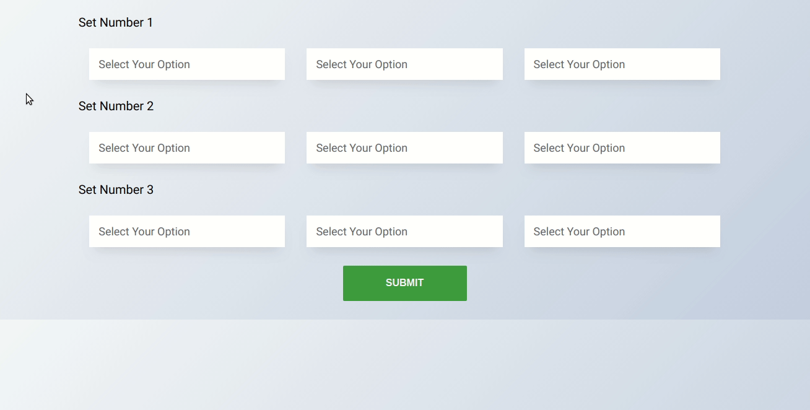

# Test APP

Build an test app with React, Redux, Redux-Saga. Add test files using Jest and Enzyme.



## Prerequisites

```sh
sudo apt-get update
sudo apt-get install npm
```

## Installation and Usage

```sh
git clone https://github.com/tanmoyopenroot/select-options.git
cd select-options
npm install
```
